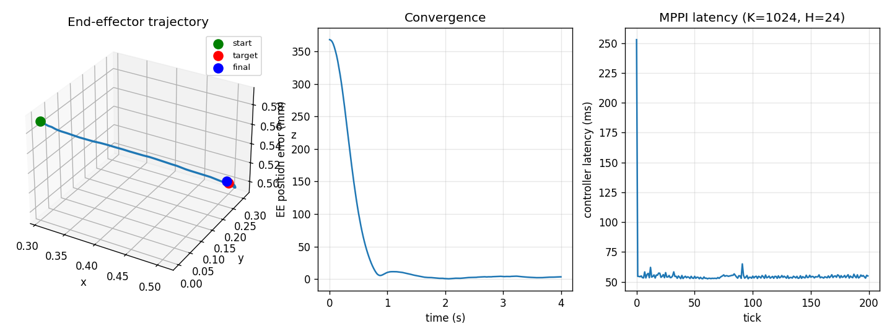

# mppi-cuda

> Fused CUDA MPPI kernels for real-time robot manipulation.

**Status:** Day 1 — PyTorch baseline. CUDA kernels coming in days 2–4.

Model Predictive Path Integral (MPPI) control is one of the dominant sampling-based MPC algorithms used in robot manipulation. It is gradient-free, handles non-smooth costs and contact discontinuities, and parallelises trivially over thousands of independent rollouts. That last property makes it a natural target for GPU acceleration — but most reference implementations leave a lot on the table because every step of every rollout becomes a separate PyTorch op, and the kernel launch overhead drowns the actual work.

This project ships a fused CUDA kernel for the MPPI rollout-and-weight pipeline, tuned for the regime that matters in real-time manipulation: small state (tens of dims), short horizons (20–50 steps), thousands of parallel rollouts. The kernel runs the entire rollout for one trajectory in registers, eliminating all intermediate global-memory traffic and collapsing hundreds of kernel launches per control tick into one.

## Example: Franka Panda reaching task

The Day 1 demo runs an MPPI controller on a 7-DoF Franka arm. The plant is a double-integrator in joint space; the cost is task-space position error to a target, plus standard smoothness and joint-limit terms.

```bash
PYTHONPATH=. python examples/01_arm_reach.py
```

Output on CPU (PyTorch baseline, no kernel yet):

```
Device:               cpu
K (samples), H (horizon): 1024, 24
Ran 200 control ticks
Per-tick latency: mean 106.06 ms, median 104.56 ms, p99 127.36 ms
Final position error: 2.21 mm
```



The controller drives the EE from the Franka home pose to within ~2 mm of a target in about 1 second of simulated time. The 106 ms-per-tick latency on CPU is precisely why the CUDA kernel exists — humanoid manipulation controllers want to run at 200+ Hz (5 ms budget).

## Roadmap

- [x] **Day 1** — PyTorch baseline. MPPI controller, double-integrator arm, Franka FK, reaching cost, end-to-end demo, tests.
- [ ] **Day 2** — Fused CUDA kernel for the rollout + per-step cost. MuJoCo as the plant; double-integrator stays as the controller's predictive model.
- [ ] **Day 3** — Templated dynamics. Add learned MLP dynamics with weights loaded into shared memory.
- [ ] **Day 4** — Obstacle avoidance demo. Benchmarks (latency, throughput, K/H/dim sweeps).
- [ ] **Day 5** — Documentation, README polish, headline GIF.

## Install

```bash
pip install -e .
# or, with viz + test extras:
pip install -e ".[dev]"
```

## Layout

```
mppi-cuda/
├── mppi_cuda/        # Python package: controller, dynamics, costs, kinematics
├── csrc/             # CUDA kernels (coming soon)
├── examples/         # Demos
├── tests/            # Correctness tests
├── benchmarks/       # Latency / throughput suites
├── baselines/        # Reference implementations for comparison
└── docs/             # Algorithm notes, kernel design, benchmark methodology
```

## References

- Williams, Aldrich, Theodorou. *Model Predictive Path Integral Control: From Theory to Parallel Computation* (2017).
- Bhardwaj et al. *STORM: Sampling Tree Optimization for Real-time Manipulation* (2021).
- UMich's `pytorch_mppi` (https://github.com/UM-ARM-Lab/pytorch_mppi) — used as a reference for the baseline algorithm.

## License

MIT.
