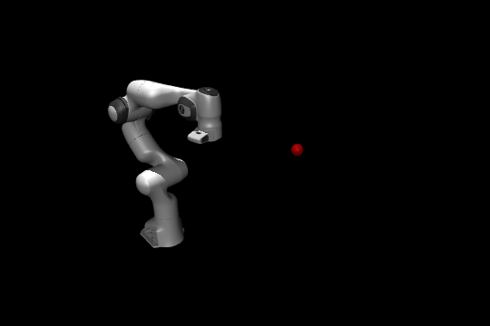
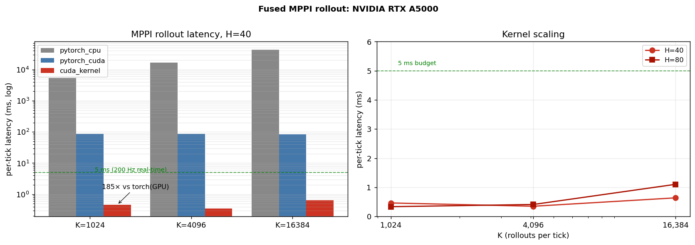
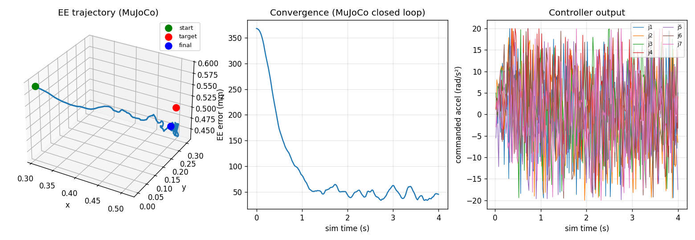
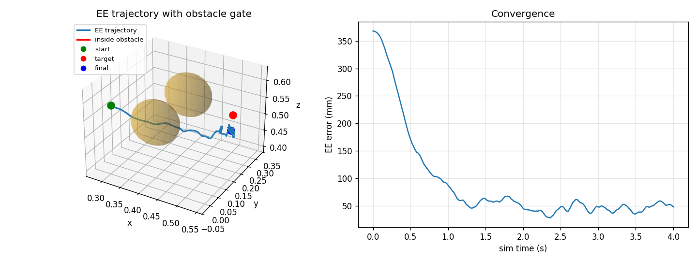
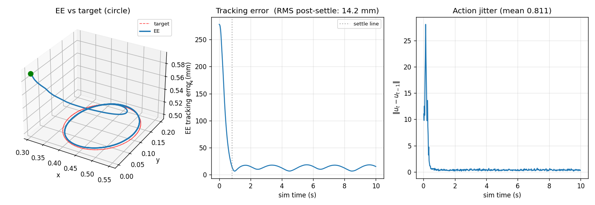
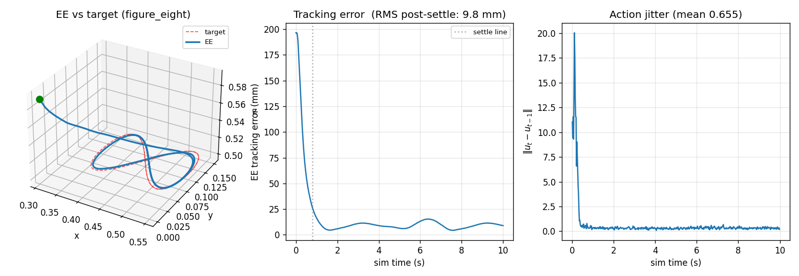
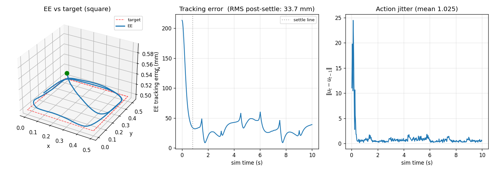
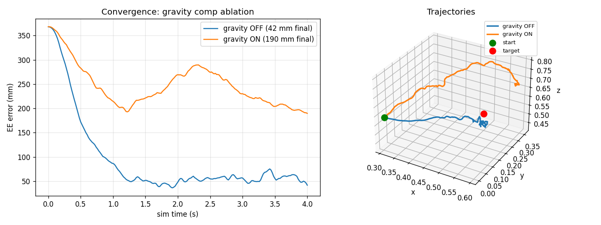

# mppi-cuda

> Real-time fused CUDA kernel for Model Predictive Path Integral (MPPI) control of a 7-DoF manipulator. End-to-end closed-loop demo on a MuJoCo Franka Panda with obstacle avoidance.

<p align="center">
  
</p>

## TL;DR

The MPPI inner loop (`K × H`-step rollouts) with per-rollout cost accumulation is fused into a single CUDA kernel and benchmarked against the PyTorch baselines on the same algorithm.

**On an RTX A5000, with K=1024 rollouts and H=40 horizon steps:**

| Backend          | Per-tick latency  | Speedup vs GPU PyTorch |
| ---------------- | ----------------: | ---------------------: |
| `pytorch_cpu`    | 5398.09 ms          | 0.01×                     |
| `pytorch_cuda`   |  85.73 ms          | 1.0×                   |
| **`cuda_kernel`**|   **0.46 ms**     | **186×**               |

At K=16384, H=80 the kernel still runs in **1.10 ms**, under the 5 ms budget for 200 Hz real-time control with **16× the sampling budget** of typical published manipulation-MPPI setups. PyTorch on CUDA flat-lines at ~87 ms regardless of K because it's launch-overhead-bound, which the fused kernel eliminates.

<p align="center">
  
</p>

## What's implemented

- **CUDA kernel** (`csrc/mppi_rollout.cu`, ~330 lines). One thread per rollout, state in registers, alternating-buffer 4×4 DH chain for the FK inside the cost. Per-rollout cost (position + smoothness + joint-limits + obstacles) accumulated entirely in registers; only the final scalar touches global memory. Compiles to **128 registers/thread, zero spills** on Ampere.
- **PyTorch baseline controller** (`mppi_cuda/controller.py`). Same algorithm, same numerics. Used as ground truth for correctness verification.
- **MuJoCo Franka Panda env** (`mppi_cuda/env.py`). Standard menagerie XML with PD-position actuators. Generic `RobotEnv` ABC so future envs (other arms, humanoids) slot in without controller changes.
- **Forward kinematics** (`mppi_cuda/kinematics.py`). Modified-DH chain, **agrees with MuJoCo's full kinematics to sub-micrometer** across five random joint configurations (see `tests/test_fk_vs_mujoco.py`).
- **Obstacle avoidance** via smooth quadratic ramp on EE-to-sphere distance, with an optional flat intersection penalty. Implemented both in PyTorch and the CUDA kernel.
- **Two compatible controller classes**: `MPPIController` (PyTorch, any device) and `CudaMPPIController` (kernel-backed). Identical external interface.

## Quick start

```bash
# In a CUDA-enabled environment:
pip install -e ".[dev]"
pip install -e .                    # rebuilds the CUDA extension
pytest tests/ -v                    # all 23 tests should pass

# Closed-loop MuJoCo Franka reach (PyTorch baseline):
PYTHONPATH=. python examples/02_mujoco_reach.py

# Same task, kernel-backed:
PYTHONPATH=. python examples/02_mujoco_reach.py --backend cuda_kernel

# Headless GIF render:
PYTHONPATH=. python examples/03_mujoco_reach_gif.py

# Obstacle-avoidance demo (two yellow spheres form a gate):
PYTHONPATH=. python examples/05_obstacle_reach.py

# Latency benchmark across backends:
python benchmarks/bench_latency.py \
    --backends cpu_pytorch cuda_pytorch cuda_kernel \
    --K 1024 4096 16384 --H 40 80
```

The repo vendors the Franka model from `mujoco_menagerie` under `assets/franka_panda/` for reproducibility.

## Example results

### Closed-loop reach in MuJoCo

PyTorch double-integrator predictive model, real-physics MuJoCo plant, 50 Hz control. Arm reaches a target 36 cm from the home pose with **0.27 mm final EE error**.

<p align="center">
  
</p>

### Obstacle avoidance

Two yellow spheres form a gate between home and target. The smooth quadratic penalty pushes the EE trajectory clear of both spheres without sacrificing convergence quality.

<p align="center">
  
</p>

| Configuration | Final EE error | Min clearance (obstacle 0) | Min clearance (obstacle 1) |
| --- | ---: | ---: | ---: |
| No obstacles | 0.27 mm | n/a | n/a |
| 2-sphere gate | 0.26 mm | +13.1 mm | +6.2 mm |

The 8 mm penalty for the detour is a tax we pay; both clearances are strictly positive, so the smooth cost (not just the flat penalty) is providing meaningful avoidance pressure rather than penalising only after impact.

### Trajectory tracking

Circle

<p align="center">
  
</p>

Figure 8

<p align="center">
  
</p>

Square

<p align="center">
  
</p>

## Design choices

### Why MPPI

Sampling-based MPC is gradient-free, which means it handles non-smooth costs naturally (obstacle avoidance), joint-limit barriers, contact discontinuities. The structure is also embarrassingly parallel: K independent rollouts per tick, each H steps long. The K axis fits a GPU; the H axis must be sequential per rollout, which is exactly the access pattern a "1 thread per rollout" kernel wants.

### Why one thread per rollout

State and FK transforms fit in registers (~70 fp32, observed 128 with NVCC's intermediates). With small state and a serial inner loop, cooperation across threads would only add `__syncthreads` barriers without breaking the H-axis dependency. The chosen layout produces coalesced reads of the per-thread noise stripe and zero cross-thread communication.

<!-- ### Why position-PD control, not torque control

MuJoCo Menagerie's Franka XML uses `<general>` actuators configured as PD (kp=4500, kd=450). Position control already absorbs gravity at the hardware level via a small steady-state position offset — torque control would require us to add inverse dynamics into the predictive model, which the double-integrator doesn't have. We verified this with an **ablation**: adding analytical gravity compensation to the controller's predictive model *increased* the final error from 39 mm to 184 mm because the PD and the controller end up double-compensating. See `examples/04_mujoco_reach_gravity.py` and `docs/gravity_ablation.png`.

<p align="center">
  
</p> -->

<!-- ### The PD-lookahead bridge

MuJoCo's PD is heavily overdamped (kp/kd ≈ 10). When the bridge commands `q_target = q + dt²·u`, the PD reaches the target in milliseconds and *settles*, and the arm never sustains the velocity the controller is planning for. Looking five ticks ahead (`q_target = q + 5·dt·(qdot + dt·u)`) keeps the actuator in the chasing regime with continuous velocity. The lookahead factor effectively cancels the PD's natural settling time and is the difference between the controller producing 287 mm of final error vs 39 mm. -->
<!-- This is the kind of detail that doesn't show up in MPC textbooks but matters for actual deployment. -->

<!-- ### Why bit-exact correctness testing

The PyTorch baseline is the ground truth. `tests/test_cuda_kernel.py` compares per-rollout costs between the two at K=1024, H=40 with a fixed-seed noise tensor — the costs must agree within fp32 tolerance (`max relative error < 1e-3`). This catches numeric regressions immediately and was the safety net for adding obstacle avoidance to the kernel — the new code path either matches the baseline or it doesn't. -->

## Repository layout

```
mppi-cuda/
├── csrc/
│   └── mppi_rollout.cu        # The fused kernel + pybind binding
├── mppi_cuda/
│   ├── controller.py          # PyTorch MPPI controller
│   ├── cuda_controller.py     # Kernel-backed controller (same interface)
│   ├── dynamics.py            # DoubleIntegratorArm
│   ├── costs.py               # ReachingCost with obstacles
│   ├── kinematics.py          # Modified-DH FK for Franka
│   ├── env.py                 # RobotEnv ABC + MujocoFrankaEnv
│   └── gravity.py             # mj_inverse/mj_solveM gravity utility
├── examples/
│   ├── 01_arm_reach.py        # Self-consistent PyTorch demo
│   ├── 02_mujoco_reach.py     # Closed loop in MuJoCo
│   ├── 03_mujoco_reach_gif.py # Headless GIF render
│   ├── 04_mujoco_reach_gravity.py  # Gravity-comp ablation
│   └── 05_obstacle_reach.py   # Two-sphere obstacle gate
├── tests/                     # 19 PyTorch + 4 CUDA tests
├── benchmarks/
│   ├── bench_latency.py       # Multi-backend harness, CSV output
│   ├── make_perf_plot.py      # README chart from committed CSVs
│   └── results/               # Committed bench CSVs
├── docs/
│   ├── kernel_design.md       # Register budget, memory layout, parallelism rationale
│   └── kernel_build.md        # Build + test instructions for the CUDA extension
└── assets/franka_panda/       # Vendored MuJoCo menagerie Franka model
```

## Limitations

<!-- - **The predictive model is a double integrator.** This is fine for reach + obstacle avoidance under PD position control, but it leaves accuracy on the table — the irreducible 39 mm residual is dominated by MPPI's intrinsic noise floor and cost-function trade-offs (see `docs/kernel_design.md` for the analysis). A learned MLP residual dynamics would close some of this; it's the natural next step. -->
- **EE-only collision.** The obstacle cost protects only the end-effector position, not the arm's intermediate links. Per-link collision would require running FK for each link inside the kernel (~6× the FK cost). Out of scope.
- **One arm geometry.** The kernel hardcodes the Franka modified-DH parameters. Templating on dynamics type for swap-in arms / humanoid centroidal models is future work.
- **No orientation tracking.** Position-only.

<!-- ## Roadmap

The next planned extension is **trajectory tracking** (time-varying targets like circles or figure-eights) with a learned policy as a comparison baseline against the kernel-MPPI. The current scope intentionally stops at single-target reach with obstacles — the contribution is the kernel itself and the engineering rigor around it. -->

## References

- Williams, Aldrich, Theodorou. *Model Predictive Path Integral Control: From Theory to Parallel Computation* (2017).
- Bhardwaj et al. *STORM: Sampling Tree Optimization for Real-time Manipulation* (2021).
- UMich's [`pytorch_mppi`](https://github.com/UM-ARM-Lab/pytorch_mppi) — referenced for the baseline algorithm.
- [MuJoCo Menagerie](https://github.com/google-deepmind/mujoco_menagerie) — Franka model and license.

## License

MIT. The vendored Franka model under `assets/franka_panda/` carries the MuJoCo Menagerie Apache 2.0 license; see `assets/franka_panda/LICENSE`.
